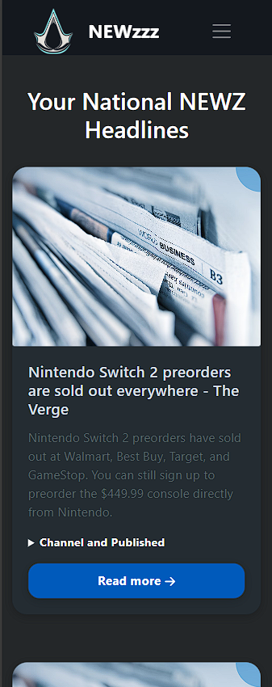

# 🗞️ Newzzz-Your Portal to Diverse Perspectives

> _A full-stack, responsive news portal built with React, Node.js & ©Newsapi's API to display real-time news articles from various sources._

<p align="center">
<p align="center">
  <a href="https://github.com/YashasveeWankhade/Newzzz/issues" target="_blank">
    
  </a>
  
  <a href="https://github.com/YashasveeWankhade/Newzzz/pulls" target="_blank">
    
  </a>

  

  

  

  

  

  
</p>

</p>


---
<p align="center">
  
  &nbsp;&nbsp;&nbsp;
  
</p>

---

## ✨ Features

- 📰 Browse top headlines from multiple categories and sources
- 🔍 Search and filter news articles
- 🧠 State management with Redux Toolkit
- 📱 Fully responsive UI across devices
- 🌓 Dark/Light mode toggle
- 🐳 Docker support for containerized deployment
- 💻 XAMPP server integration for local MySQL database

## 🧰 Tech Stack

| Frontend       | Backend     | Database        | State Management | Styling        | DevOps         |
|----------------|-------------|-----------------|------------------|----------------|----------------|
| React          | Node.js     | MySQL (XAMPP)   | Redux Toolkit    | Tailwind CSS   | Docker         |
| Axios          | Express.js  | MariaDB         | Redux            | Responsive UI  | Docker Compose |

## 🛠️ Project Setup & Deployment

### 1. Clone the repository
```bash
git clone https://github.com/your-username/Newzzz.git
```

### 2. Backend Setup
```bash
cd Newzzz/backend
npm install
npm start
```

### 3. Frontend Setup
```bash
cd ../
npm install
npm start
```

### 4. Access the App
-  Open your browser and navigate to:
```bash
http://localhost:3000
```

## 📦 XAMPP Deployment

### 5. Build the React App
```bash
npm run build
```

### 6. Set homepage in package.json
```bash
# Add: "homepage": "http://localhost/Newzzz"
```

### 7. Copy build files to XAMPP htdocs
```bash
xcopy /E /I build C:\xampp\htdocs\Newzzz
```

### 8. Start XAMPP (Apache + MySQL), then open:

> - http://localhost/Newzzz

## 🐳 Docker Setup

### 9. Docker Compose (Recommended)
```
docker-compose up -d
docker-compose down
```
### 10. Manual Docker Setup - Backend
```
cd backend
docker build -t Newzzz-backend .
docker run -p 5000:5000 Newzzz-backend
```
### 11. Manual Docker Setup - Frontend
```
cd ../frontend
docker build -t Newzzz-frontend .
docker run -p 3000:3000 Newzzz-frontend
```

---

## ⚙️ Environment Configuration

### Backend `.env.example`

```env
PORT=5000
NODE_ENV=development

DB_HOST=localhost
DB_USER=root
DB_PASSWORD=
DB_NAME=news_app_db

NEWS_API_KEY=your_api_key_here
NEWS_API_ENDPOINT=https://newsapi.org/v2
```

### Frontend `.env.example`

```env
REACT_APP_API_URL=http://localhost:3000/api
REACT_APP_DEFAULT_LANGUAGE=en
REACT_APP_DEFAULT_THEME=light
```

---

## 📋 PHP Integration with React (XAMPP)

Create a file `api/news.php` in your XAMPP `htdocs` folder:

```php
<?php
header('Content-Type: application/json');
$conn = mysqli_connect("localhost", "root", "", "news_app_db");

if (!$conn) {
    echo json_encode(["error" => "Connection failed: " . mysqli_connect_error()]);
    exit();
}

$query = "SELECT * FROM news ORDER BY created_at DESC";
$result = mysqli_query($conn, $query);

$newsItems = [];
while ($row = mysqli_fetch_assoc($result)) {
    $newsItems[] = $row;
}

echo json_encode(["data" => $newsItems]);
?>
```

## 🏗️ System Architecture

## 🏷️ License
  <a href="https://opensource.org/licenses/MIT" target="_blank">
    
  </a>
  
This project is licensed under the [MIT License](https://opensource.org/licenses/MIT).
  
`© 2025 YashasveeWankhade. All rights reserved.`
